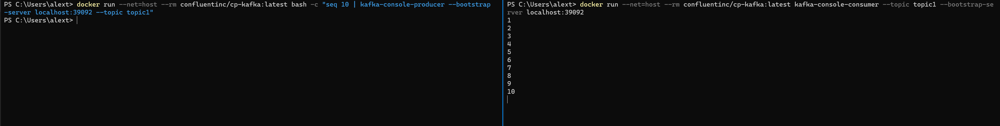

# CS3219 OTOT Task D
Name: Teo Yick Fong Alex
 
Student Number: A022144R
 
Repo link: [https://github.com/alexteo98/otot-d](https://github.com/alexteo98/otot-d)

## Task D-1
1. Create a docker compose project containing 6 docker containers, 3 for kafka brokers and 3 for zookeeper nodes
2. Create the containers by using the docker-compose.yml file in this repo 
   * .  `docker  compose up -d`
3. Verify that the containers are running
   * . `docker ps`

1. Create a new topic
   1. `docker run --net=host --rm confluentinc/cp-kafka:latest kafka-topics --create --topic topic1 --partitions 3 --replication-factor 3 --if-not-exists --bootstrap-server localhost:39092`

2. Check that the topic has been created successfully
   1. `docker run --net=host --rm confluentinc/cp-kafka:latest kafka-topics --list --bootstrap-server localhost:39092`

3. Start another shell and begin listening for incoming messages on `topic1` by using `kafka-console-consumer`
   1. `docker run --net=host --rm confluentinc/cp-kafka:latest kafka-console-consumer --topic topic1 --bootstrap-server localhost:39092`
   2. Now, any messages published to `topic1` will be displayed on this shell.

4. Send messages to the message broker using `kafka-console-producer`
   1. For this, we will send 10 messages from `1` to `10` by starting `kafka-console-producer` and echoing the values into the shell
   2. `docker run --net=host --rm confluentinc/cp-kafka:latest bash -c "seq 10 | kafka-console-producer --bootstrap-server localhost:39092 --topic topic1"`

5. The messages `1` to `10` should be displayed on the shell that is consuming the message and it will be waiting for further messages published to `topic1`.

## Task D-2
1. Describe current cluster
   1. `docker run --net=host --rm confluentinc/cp-kafka:latest kafka-topics --describe --topic topic1 --bootstrap-server localhost:39092`
   2. Currently, broker 3 is the leader of partition 2, with all brokers being in-sync replicas.

2. Kill broker 3
3. Describe cluster again
   1. `docker run --net=host --rm confluentinc/cp-kafka:latest kafka-topics --describe --topic topic1 --bootstrap-server localhost:29092`
   2. Broker 3 is killed and broker 1 takes over as the leader for partition 1.
   3. In-sync replicas are left with broker 1 and 2 as 3 is dropped from the cluster.

